# 🎤 Mock Interview AI

음성으로 답하는 AI 모의 면접 플랫폼


> [Job Agent v3](https://github.com/HyeonBin0118/job-agent-v3)에서 만든 면접 질문 생성 기능을 독립 서비스로 분리하고, 음성 답변 평가까지 붙인 프로젝트입니다.

🎬 **[데모 영상 보기](https://youtu.be/cCh4mFKcWrI)**

---

## 시작 배경

Job Agent v3에 면접 질문 생성 기능을 붙였는데, 막상 만들고 보니 질문을 받기만 하고 실제로 답해볼 수단이 없었습니다. 텍스트로 답을 적는 건 실제 면접과 너무 달랐고, 혼자 소리 내서 말해봐도 잘 했는지 알 방법이 없었습니다.

그래서 이번엔 **음성으로 답하면 그 답을 평가받는** 흐름까지 만들어보기로 했습니다. 이번 프로젝트에서는 그동안 다뤄보지 않았던 기술들도 함께 적용했습니다.

- Streamlit 단일 앱이 아닌 FastAPI로 백엔드 분리
- PostgreSQL로 연습 기록 영구 저장
- Docker Compose로 멀티 컨테이너 환경 구성
- Whisper API 음성 처리 직접 연동

---

## 사용 흐름

```
STEP 1 · 입력          STEP 2 · 질문 생성
공고 URL + 이력서  ──▶  AI 면접 질문 8개
사용자 입력             GPT-4o-mini · 4개 카테고리
│
▼
STEP 4 · 변환          STEP 3 · 답변
텍스트 변환 + 수정  ◀──  마이크 녹음 또는 mp3 업로드
Whisper API             방식 선택 가능
│
▼
STEP 5 · 평가
GPT 평가 → 점수 + 피드백
논리성 · 구체성 · 시간 관리
```

---

## 주요 기능

**1. 맞춤형 질문 생성**
채용공고 URL과 이력서 텍스트를 입력하면 보유 스킬, 부족 스킬, 직무, 인성 네 가지 카테고리로 면접 질문 8개를 자동 생성합니다.

**2. 음성 답변 평가**
마이크로 답변을 녹음하거나 mp3 파일을 업로드하면 Whisper API가 텍스트로 변환하고, GPT가 논리성, 구체성, 시간 관리 세 가지 지표로 평가합니다.

**3. 텍스트 확인 및 수정 후 재평가**
Whisper 변환 결과를 화면에 표시하고 수정할 수 있습니다. 수정된 텍스트로 GPT에 재평가를 요청하므로 인식 오류가 있어도 정확한 평가를 받을 수 있습니다. 시간 점수는 원본 녹음 시간 기준으로 산출됩니다.

**4. 연습 기록 저장 및 추적**
면접 세션, 질문, 답변, 평가 결과를 PostgreSQL에 저장합니다. 같은 질문을 반복 연습하면서 점수 변화를 추적할 수 있으며, 세션별 답변 이력과 점수 추이를 조회할 수 있습니다.

**5. Redis 캐싱**
동일 공고 URL 재요청 시 크롤링과 공고 분석을 건너뛰고 Redis에서 바로 반환합니다. 구간별 응답 시간을 측정한 결과는 아래와 같습니다.

| 단계 | CACHE MISS | CACHE HIT |
|---|---|---|
| 크롤링 + 공고 분석 | 6,538ms | 0ms (캐시 반환) |
| 이력서 매칭 | 5,138ms | 4,483ms |
| 질문 생성 | 22,829ms | 21,254ms |
| **전체** | **34,514ms** | **25,737ms** |

캐싱으로 크롤링+공고 분석 단계가 제거되어 약 **8,800ms (25%) 단축**됩니다. 질문 생성은 매 요청마다 새로 생성하는 구조라 캐싱 대상이 아닙니다.

---

## 기술 스택

| 분류 | 기술 |
|---|---|
| Backend | FastAPI, Python 3.11 |
| Database | PostgreSQL 16 + SQLAlchemy ORM |
| Cache | Redis 7 |
| AI | GPT-4o-mini, Whisper API |
| Container | Docker Compose |
| Frontend | Vanilla JS, Web Audio API, MediaRecorder API |

> **Docker Compose 사용 이유**: PostgreSQL과 Redis를 로컬에 직접 설치하지 않고 컨테이너로 띄웠습니다. `docker-compose up -d` 한 번으로 동일한 개발 환경을 재현할 수 있어, 환경 차이로 인한 문제를 줄이고 정리할 때도 컨테이너만 내리면 됩니다.

---

## 아키텍처
```
┌─────────────────────────────────┐
│           Frontend              │  녹음 UI · 음파 시각화 · 텍스트 수정
│      Vanilla JS + Web Audio API │
└────────────────┬────────────────┘
│ HTTP
┌────────────────▼────────────────┐
│     Backend · FastAPI           │
│  ─ 질문 생성  (크롤링 + GPT)     │
│  ─ 음성 변환  (Whisper API)      │
│  ─ 답변 평가  (GPT-4o-mini)      │
│  ─ 텍스트 재평가                 │
└───────┬─────────────┬───────────┘
│             │
┌───────▼──────┐ ┌────▼──────────┐
│   Redis 7    │ │ PostgreSQL 16 │
│ 공고 캐시    │ │ SQLAlchemy ORM│
│ 1시간 TTL    │ │ 4개 테이블    │
└──────────────┘ └───────────────┘
```
전체 서비스는 Docker Compose로 컨테이너화되어 단일 명령으로 구동됩니다.

---

## DB 모델
```
InterviewSession  ->  Question  ->  Answer  ->  EvaluationResult
(공고 + 이력서)      (질문 8개)    (음성 답변)   (GPT 평가 결과)
```
세션 하나당 질문 여러 개, 질문 하나당 답변 여러 번 — 같은 질문을 반복 연습하면서 점수 변화를 추적할 수 있는 구조로 설계했습니다.

---

## API 명세

| Method | Endpoint | 설명 |
|---|---|---|
| POST | `/api/v1/sessions` | 세션 생성 (공고 크롤링 + 질문 생성) |
| GET | `/api/v1/sessions` | 세션 목록 조회 (최신순) |
| GET | `/api/v1/sessions/{id}` | 세션 조회 |
| GET | `/api/v1/sessions/{id}/history` | 세션 상세 + 질문별 답변 이력 + 점수 추이 |
| POST | `/api/v1/questions/{id}/answers` | 음성 답변 제출 |
| GET | `/api/v1/questions/{id}/answers` | 특정 질문의 모든 답변 조회 |
| GET | `/api/v1/answers/{id}/feedback` | 답변 평가 결과 조회 |
| POST | `/api/v1/evaluate-text` | 수정된 텍스트로 재평가 |

---

## 평가 지표 산정 방식

답변은 세 가지 지표로 채점됩니다.

**논리성 (1~5)**
답변이 질문 의도와 부합하는지, 주장과 근거의 연결이 명확한지를 GPT가 평가합니다. 면접관 관점에서 "답이 됐는가"를 보는 지표입니다.

**구체성 (1~5)**
답변에 구체적 수치, 사례, 기술명이 포함되는지를 평가합니다. "프로젝트에서 Redis를 썼습니다"보다 "프로젝트에서 Redis로 1시간 TTL 캐싱을 적용해 응답 속도를 개선했습니다"가 더 높은 점수를 받습니다.

**시간 관리 (1~5)**
답변 길이가 적절한지를 녹음 시간 기준으로 채점합니다. 실제 면접에서 권장되는 답변 시간(60~120초)을 기준으로 설계했습니다.

| 녹음 시간 | 점수 |
|---|---|
| 30초 미만 | 1점 (너무 짧음) |
| 30~60초 | 3점 (다소 짧음) |
| 60~120초 | 5점 (적절) |
| 120초 초과 | 2점 (너무 길음) |

녹음 시간 기준으로 산출하기 때문에 텍스트를 수정해도 시간 점수는 영향받지 않습니다.

---

## 주요 화면

### Phase 1 — API 구조 및 DB 연결

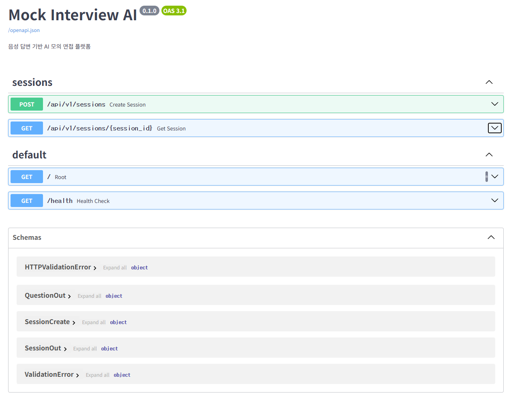

> FastAPI 자동 생성 OpenAPI 문서 — Phase 1 시점. sessions와 answers 두 개 라우터가 등록된 상태입니다. (이후 Phase 4에서 히스토리 엔드포인트 3개 추가)

<br>

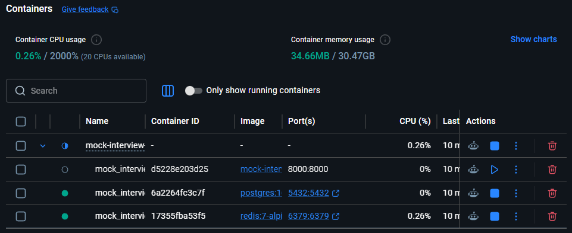

> Docker Compose로 API / PostgreSQL / Redis 3개 컨테이너를 구성했습니다. `docker-compose up -d` 명령 하나로 전체 환경이 올라옵니다.

<br>

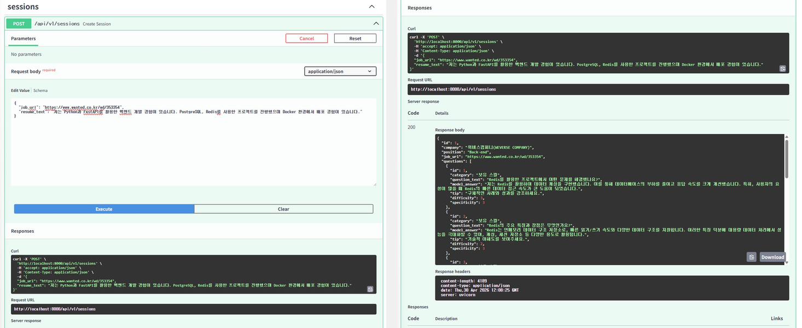

> `POST /api/v1/sessions` 테스트 결과입니다. 공고 URL과 이력서를 입력하면 크롤링, 분석, 질문 생성, DB 저장이 한 번에 처리됩니다.

<br>

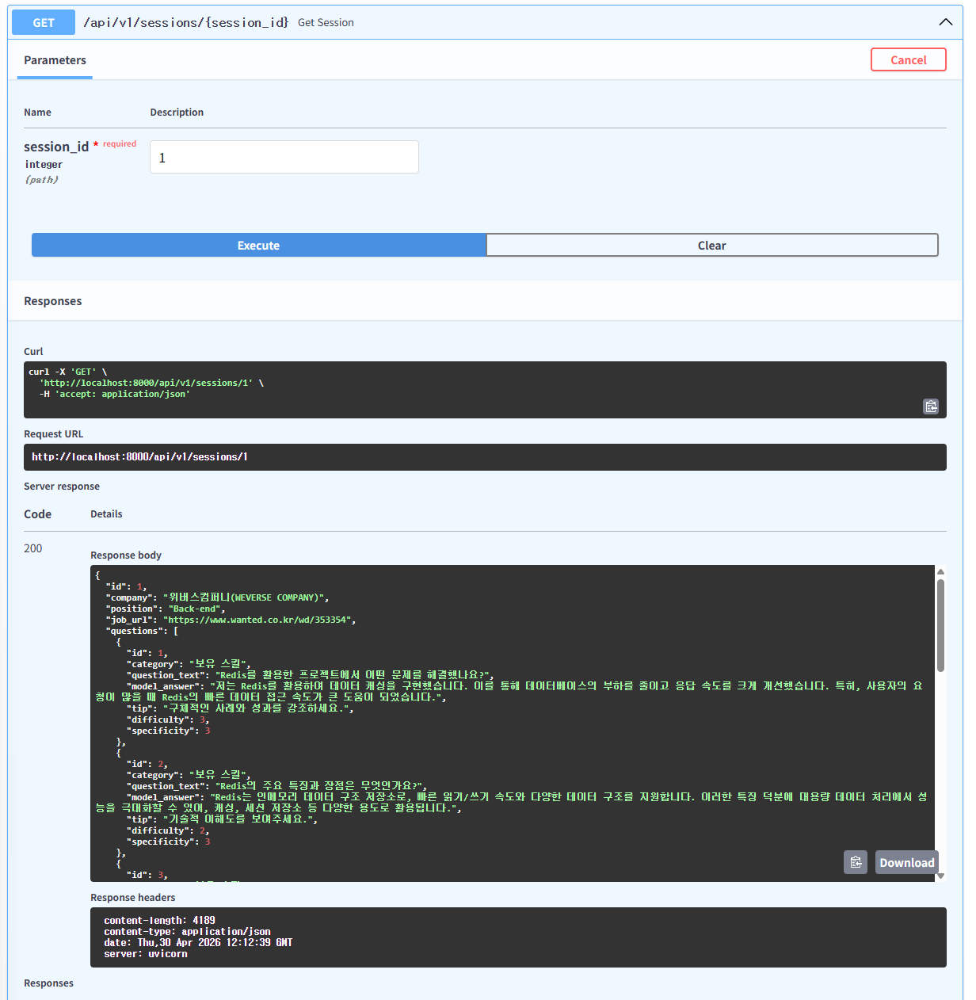

> `GET /api/v1/sessions/1` 응답입니다. 생성된 세션과 질문 목록을 조회할 수 있습니다.

<br>

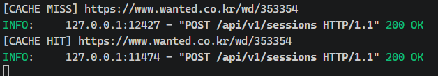

> 동일한 공고 URL로 두 번 요청했을 때의 서버 로그입니다. 첫 번째 요청은 크롤링과 GPT 호출이 발생하고(CACHE MISS), 두 번째 요청부터는 Redis에서 바로 반환됩니다(CACHE HIT).

<br>

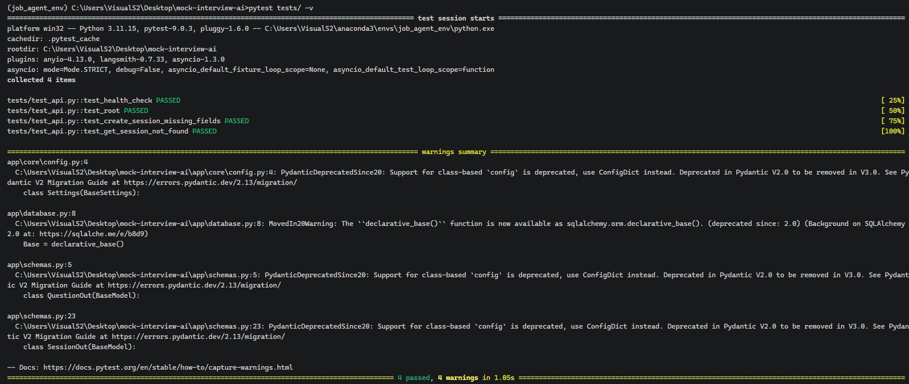

> API 서버 상태 확인(health, root)과 에러 처리(잘못된 입력 422, 존재하지 않는 리소스 404) 등 기본 동작과 예외 케이스를 검증하는 테스트 4개를 작성했습니다.

<br>

### Phase 2 — 음성 처리 파이프라인

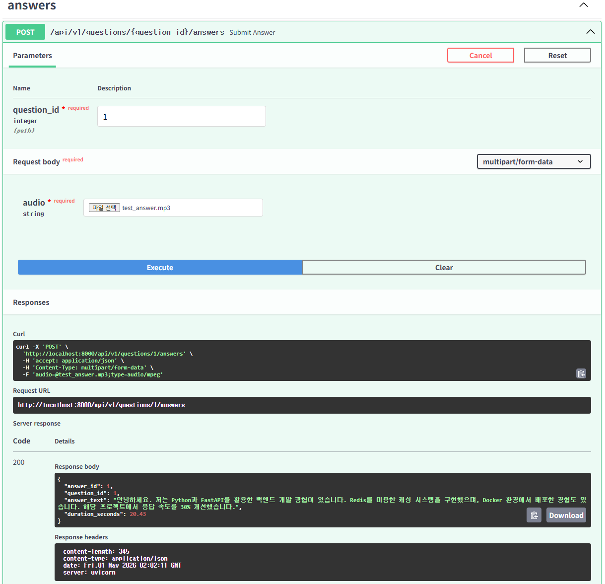

> mp3 파일을 업로드하면 Whisper API가 음성을 텍스트로 변환하고 DB에 저장합니다.

<br>

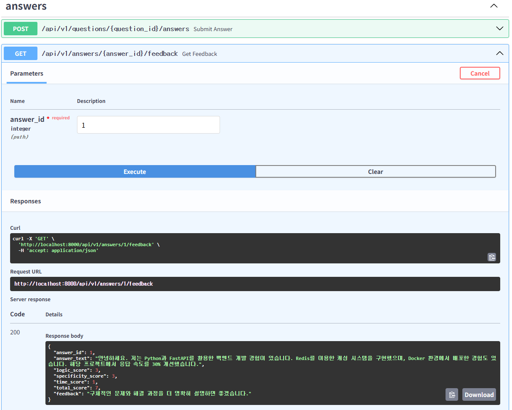

> `GET /api/v1/answers/1/feedback` 응답입니다. GPT가 논리성, 구체성, 시간 관리 세 가지 지표로 평가하고 한 줄 피드백을 제공합니다.

<br>

### Phase 3 — 녹음 UI

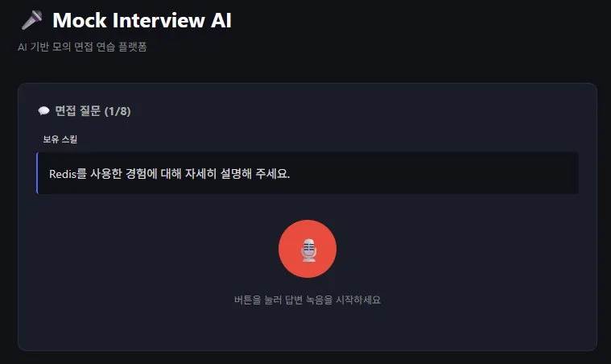

> 면접 질문 화면입니다. 카테고리 색상(보유 스킬/부족 스킬/직무/인성)과 마이크 선택 드롭다운, 타이머가 제공됩니다.

<br>

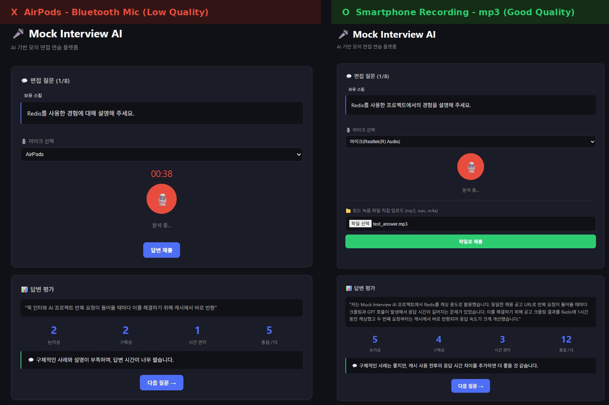

> 에어팟 블루투스 마이크(왼쪽)와 스마트폰 녹음 파일 업로드(오른쪽)의 인식 결과 비교입니다. 자세한 내용은 아래 섹션을 참고하세요.

<br>

### Phase 4 — 연습 기록 및 점수 추이

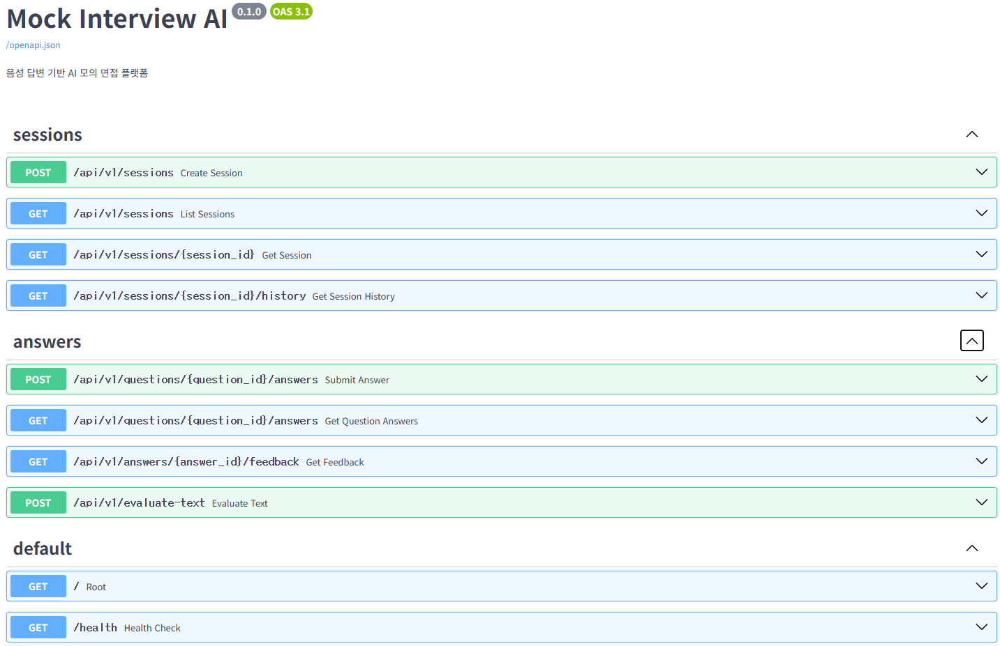

> 히스토리 관련 엔드포인트 3개가 추가된 API 문서입니다. 세션 목록, 세션 상세 이력, 질문별 답변 조회가 가능합니다.

<br>

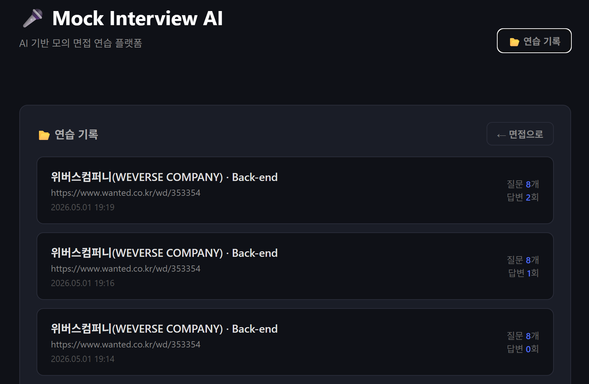

> 연습 기록 목록 화면입니다. 세션별 회사명, 포지션, 날짜, 질문 수, 답변 횟수를 확인할 수 있습니다.

<br>

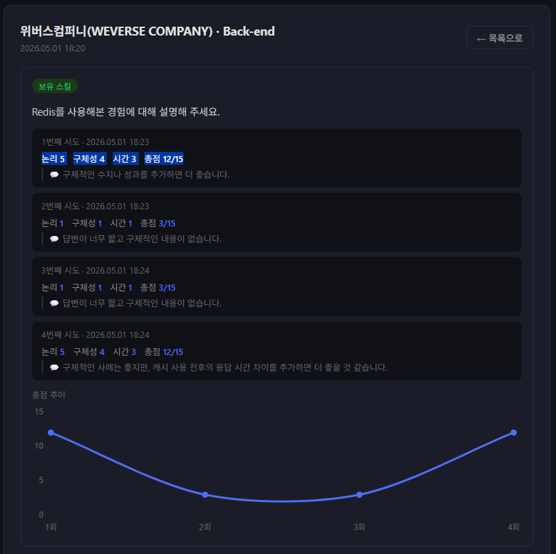

> 세션 상세 화면입니다. 같은 질문에 여러 번 답변한 경우 시도별 점수와 피드백, 총점 추이 그래프를 확인할 수 있습니다.

---

## UI 개선 기록 (26.05.02)

초기 UI는 단순했는데, 직접 써보면서 불편한 부분이 계속 나와서 그때그때 고쳤습니다.

**마이크 선택 드롭다운**
브라우저 기본 마이크가 아닌 다른 장치로 입력하려면 직접 선택할 수 없는 문제가 있었습니다. Web Audio API로 연결된 오디오 장치 목록을 불러와 드롭다운으로 표시했습니다.

**음파 시각화**
녹음이 실제로 되고 있는지 사용자가 확인할 방법이 없었습니다. Web Audio API의 AnalyserNode로 실시간 주파수 데이터를 읽어 Canvas에 막대 그래프로 렌더링했습니다.

**입력 방식 선택 화면 분리**
마이크 녹음 버튼과 파일 업로드 버튼이 같은 화면에 나란히 있어 역할이 헷갈렸습니다. 첫 화면에서 두 방식 중 하나를 카드로 선택하면 해당 UI만 표시되도록 바꿨습니다. 뒤로가기 버튼으로 다시 선택 화면으로 돌아올 수 있습니다.

**Whisper 변환 결과 수정 후 재평가**
녹음을 마치면 Whisper가 변환한 텍스트를 수정 가능한 textarea로 표시합니다. 인식 오류가 있으면 직접 고친 뒤 "이 내용으로 평가받기"를 누르면 수정된 텍스트로 GPT에 재평가를 요청합니다. 시간 점수는 수정과 무관하게 원본 녹음 길이 기준으로 산출합니다.

---

## 블루투스 마이크의 한계

브라우저에서 블루투스 마이크로 녹음하면 Whisper 인식률이 크게 떨어집니다. 에어팟으로 테스트했을 때 실제 발화의 일부만 인식되거나, 전혀 다른 텍스트가 나오는 경우가 있었습니다.

같은 내용을 스마트폰으로 녹음해 mp3로 업로드하면 정상 인식됐기 때문에 음성 처리 파이프라인 자체의 문제는 아니라고 판단했습니다. 정확한 원인까진 파악하지 못했지만 블루투스 마이크와 브라우저 MediaRecorder의 코덱 호환 문제로 추정됩니다.

| | AirPods (블루투스) | 스마트폰 mp3 업로드 |
|---|---|---|
| 인식된 텍스트 | "목 인터뷰 AI 프로젝트 반복 요청이 들어올 때마다..." | 발화 내용 전체 정확하게 인식 |
| 논리성 | 2 / 5 | 5 / 5 |
| 구체성 | 2 / 5 | 4 / 5 |
| 총점 | 5 / 15 | 12 / 15 |

이 때문에 UI에 파일 직접 업로드 기능을 추가했습니다. 블루투스 마이크를 사용하는 경우 스마트폰으로 별도 녹음 후 mp3 파일로 업로드하는 방식을 권장합니다.

---

## 한계 및 향후 개선

### 현재 한계
- **답변 평가의 객관성** — GPT 자체 평가의 한계 (job-agent v3에서도 동일하게 확인된 문제)
- **실시간 스트리밍 미적용** — 현재는 전체 녹음 후 일괄 처리 방식

### 향후 개선
- WebSocket 기반 실시간 답변 분석
- 답변 평가 모델 다양화 (사람 평가 또는 다른 모델과의 교차 평가)

---

## 프로젝트 구조
```
mock-interview-ai/
├── app/
│   ├── api/v1/
│   │   ├── sessions.py       # 세션 관련 엔드포인트
│   │   └── answers.py        # 답변 및 평가 엔드포인트
│   ├── core/
│   │   └── config.py         # 환경변수 설정
│   ├── services/
│   │   ├── interview.py      # 크롤링, 질문 생성 로직
│   │   ├── evaluation.py     # Whisper 변환, GPT 평가 로직
│   │   └── cache.py          # Redis 캐싱
│   ├── database.py           # DB 연결
│   ├── models.py             # SQLAlchemy ORM 모델
│   ├── schemas.py            # Pydantic 스키마
│   └── main.py               # FastAPI 앱
├── alembic/                  # DB 마이그레이션
├── frontend/
│   └── index.html            # 녹음 UI
├── tests/
│   └── test_api.py           # Pytest 테스트
├── generate_test_audio.py    # 테스트용 음성 파일 생성 스크립트
├── docker-compose.yml
└── requirements.txt
```
---

## 설치 및 실행

```bash
# 1. 레포 클론
git clone https://github.com/HyeonBin0118/mock-interview-ai.git
cd mock-interview-ai

# 2. 가상환경 설정
conda create -n mock_interview python=3.11
conda activate mock_interview
pip install -r requirements.txt

# 3. 환경변수 설정
cp .env.example .env
# .env 파일에 OPENAI_API_KEY 입력

# 4. Docker Compose 실행
docker-compose up -d

# 5. DB 마이그레이션
alembic upgrade head

# 6. 서버 실행
uvicorn app.main:app --reload
```

`http://localhost:8000` 접속 시 면접 UI가 열리고, API 문서는 `http://localhost:8000/docs` 에서 확인할 수 있습니다.

테스트용 음성 파일이 필요하면 다음 스크립트로 생성할 수 있습니다.

```bash
python generate_test_audio.py
```

---

## 개발 기록

#### Streamlit 단일 앱 구조의 한계를 느꼈다

Streamlit으로도 음성 처리는 가능합니다. 다만 이번 프로젝트의 핵심 목표 중 하나가 백엔드 아키텍처를 직접 설계해보는 것이었습니다. Streamlit은 UI와 백엔드 로직이 한 파일에 묶이는 구조라 API 분리, DB 영속화, 컨테이너 환경 같은 백엔드 패턴을 연습하기 어렵다고 판단해 FastAPI로 분리했습니다. 결과적으로 라우터, 서비스, 모델 레이어를 명확히 나눌 수 있었고 기능 추가가 훨씬 수월했습니다.

#### 이력서 입력 방식을 PDF에서 텍스트로 바꿨다

v3에서는 Streamlit의 `st.file_uploader`로 PDF를 받고 PyMuPDF로 파싱하는 구조였습니다. 이번에는 FastAPI로 분리하면서 JSON Body로 텍스트를 직접 받도록 단순화했습니다. REST API 표준에 맞고, 사용자가 textarea에서 즉시 입력하거나 수정할 수 있어 흐름이 더 자연스러워졌습니다. 다만 PDF에서 자동으로 텍스트를 추출하는 편의성은 줄어들었습니다.

#### 에어팟으로 녹음하면 Whisper가 엉뚱한 말을 인식했다

브라우저에서 에어팟 마이크로 녹음해서 Whisper에 넘겼더니 실제로 한 말과 전혀 다른 텍스트가 나왔습니다. 처음엔 Whisper 설정 문제라고 생각했는데, 같은 내용을 스마트폰으로 녹음해서 mp3로 올렸더니 정상적으로 인식됐습니다. 블루투스 마이크가 브라우저 MediaRecorder와 코덱이 안 맞아서 생기는 문제로 추정됩니다. 대안으로 파일 직접 업로드 기능을 추가했습니다.

#### Redis 캐싱 효과를 구간별로 측정했다

동일 공고 URL로 두 번 요청해서 각 처리 단계의 시간을 측정했습니다. 크롤링+공고 분석 단계(6,538ms)가 캐시 히트 시 완전히 제거되어 전체 응답시간이 34,514ms → 25,737ms로 약 25% 단축됐습니다. 질문 생성이 전체의 65% 이상을 차지하는 병목이라는 것도 이 측정으로 확인했습니다. 캐싱 범위를 공고 분석으로 한정한 이유는 질문은 이력서와 조합마다 달라져야 하기 때문입니다.

#### GPT 평가를 수정된 텍스트에 적용하려면 별도 엔드포인트가 필요했다

Whisper 변환 결과를 수정해서 재평가하는 기능을 만들 때, 기존 `GET /feedback` 엔드포인트는 DB에 저장된 원본 텍스트를 그대로 평가하는 구조라 수정 내용이 반영되지 않았습니다. `POST /evaluate-text` 엔드포인트를 별도로 만들어 수정된 텍스트를 직접 넘기는 방식으로 해결했습니다.

---

## 관련 프로젝트

- [Job Agent v3](https://github.com/HyeonBin0118/job-agent-v3) — 채용공고 분석 + 자소서 생성 + 면접 질문 (이 프로젝트의 출발점)
- [Job Agent v2](https://github.com/HyeonBin0118/job-agent-v2)
- [Job Agent v1](https://github.com/HyeonBin0118/job-agent)
- [ShopAI](https://github.com/HyeonBin0118/shopping-rag-final) — RAG 기반 쇼핑몰 챗봇

---

License: MIT
